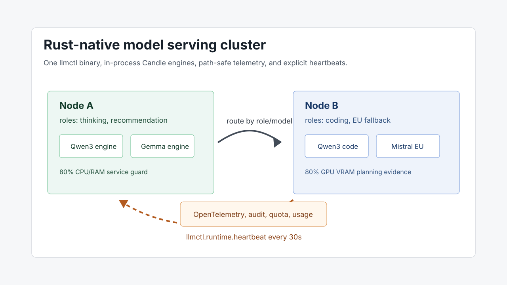
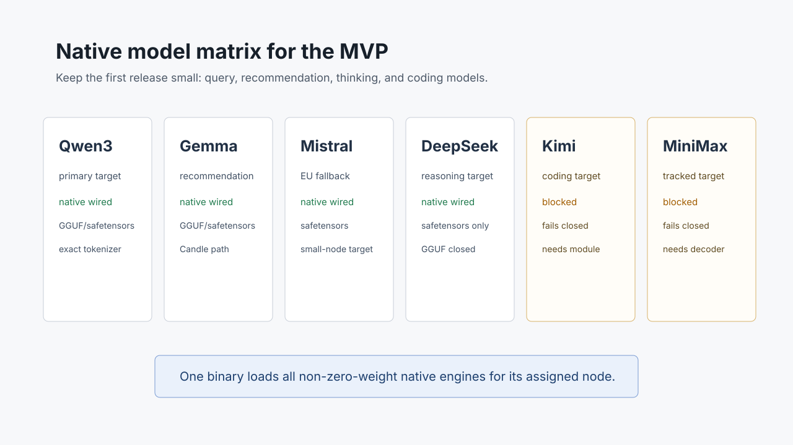

# Rust Native Model Operations

`rs-llmctl` now points at the shape we actually want for the MVP: one Rust
binary running local model operations, not a shell around a long list of
operator chores. The compatibility path for external workers remains useful,
but the default direction is Candle-native execution inside `llmctl`.

The practical change is that native serving is now a registry, not a singleton.
Every configured model with non-zero weight gets an alias-keyed native engine,
and the OpenAI-compatible route resolver selects the engine by the resolved
model alias. That matters for the starter layout: query, recommendation,
thinking, and coding models can live on one machine or be split across two
servers without changing the client API.

For a two-server setup, one node can own thinking and recommendation while the
other owns coding and an EU-friendly fallback. Heartbeat output uses the same
contract for a laptop, a single server, and a small cluster. The daemon emits
`llmctl.runtime.heartbeat` at startup and then every 30 seconds by default,
with node ID, runtime backend, placement health, assigned model counts,
unassigned aliases, and the 80% budget fraction.

The model matrix is deliberately small. Qwen3 is the primary target. Gemma is a
compact recommendation option. Mistral is the EU-friendly fallback. DeepSeek is
wired for Candle safetensors through DeepSeekV2, while DeepSeek GGUF stays
closed because Candle does not expose quantized DeepSeek2 weights. Kimi and
MiniMax remain on the contract because they are product targets, but they fail
closed until Candle exposes reviewed architecture modules or rs-llmctl vendors
maintained decoders. That caveat is intentional: operators should not plan
native capacity for blocked families until the runtime reports an implemented
engine.

The same release tightened the operational edges that usually decide whether a
service is pleasant to run. The Linux service applies `CPUQuota=80%` and
`MemoryMax=80%` by default. GPU VRAM is still reported as planning evidence,
because there is no portable systemd cgroup property for hard GPU memory
enforcement. Direct model downloads require HTTPS, expected SHA-256, and
public-address DNS resolution. Release installs verify `SHA256SUMS` and safely
extract archives before installing the binary.

Observability is part of the runtime boundary rather than an afterthought.
Requests emit RED metrics, upstream circuits are single-flight during
half-open probes, auth throttling is keyed by caller source, and graceful
shutdown flips readiness to draining before the process exits. Data exports no
longer include local model paths, and Arrow IPC/Parquet writers work in bounded
batches.

The native scheduler now applies FIFO queueing with bounded per-engine
concurrency and wait-time metadata. It emits prefill/decode phase scheduling
metadata for admitted requests, while continuous batching, cross-request
KV-cache reuse controls, and token-level cancellation token metadata remain
contract fields with `implemented=false` until those runtime behaviors are
wired.

The result is a cleaner first-time path: install one binary, let systemd keep
host headroom, import verified model artifacts, route by model or role, and
watch heartbeat, audit, quota, usage, and SLO signals from the start.
